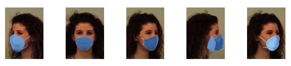
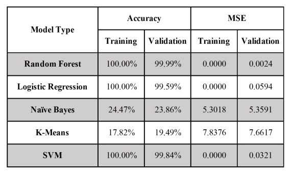
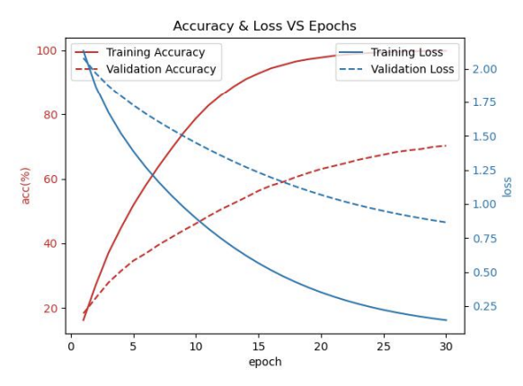

# CS229 Final Project: Facial Expression Recognition on Masked Faces
**Contributors**:
- Yoko Nagafuchi (yokongf@stanford.edu)
- Zifei Xu (zifei98@stanford.edu)
- Sally (Hanqing) Yao (yaohanqi@stanford.edu)

**Dataset**:
- Karolinska Directed Emotional Faces (KDEF):(https://www.kdef.se)
- MaskTheFace module by Aqeel Anwar for applying masks onto facial images: (https://github.com/aqeelanwar/MaskTheFace)

**Programs**:
- Emotion_Recognition.py: Training on one of the models-Naive Bayes, Logistic Regression, Random Forest, K-Means, SVM
- CNN.py: Training on customized CNN model
- ResNet.py: Training on modified pretrained ResNet18 model

**Topic**:
Through our project, we tackle the task of facial expression recognition (FER) for images of human faces that are partially covered with a mask. In real life, facial expressions play a key role in communicating with others because they reveal and convey people's emotions and reactions. However, wearing a mask, which has become a norm as we face a global pandemic, has prohibited us from seeing the whole facial expression, such that it has become difficult for us to communicate smoothly. Therefore, in our application-based project, we approach this problem with a FER program that utilizes computer vision techniques to predict expressions, given facial images partially covered with a mask. 

The input to our algorithm is a set of color images of human faces, which we pre-process by resizing and applying mask images onto the faces, as well as with other data augmentation techniques. Then, we use 6 types of models to output a predicted emotion: Logistic Regression, Naive Bayes, Random Forest, Support Vector Machine (SVM), K-Means, and Convolutional Neural Network (CNN)-with-ResNet models to classify the images into 7 classes, labeling each face with one of the 7 emotions.

**Results**:
Our random forest and logistic regression models, without data augmentation, were the highest performing in terms of accuracy (100% on validation data) and computational efficiency. We also found that Naive Bayes and K-Means did not perform well with respect to the same measures because of their assumptions about the data and simplistic models. CNN with ResNet18 performed better because of transfer-learning, using the pre-trained parameters to overcome the small size of the dataset. We cannot directly compare SVM with the other models because we could only train the model on 10 folders of images, due to the limit of our computational resources. If we were to compare SVM directly to the other models, SVM was the second best in its accuracy. However, it was the worst in its computational efficiency - it took around 24 hours to complete the program, even with a smaller dataset.

 

**Future Work**:
Our validation data is generated by a 20% split from the whole dataset, which contains a lot of images of the same people. Hence, the faces in our validation dataset is likely already have been trained when fitting the model, either with a different mask or different emotion. When we constructed a test dataset with completely new faces and feed them to the model, we found that the accuracy was a lot lower than the validation accuracy. Moreover, the KDEF datasets only contains images of Swedish adults. It will have limited performance when predicting for other populations, for example, Asians or children. Future works to be done to tackle this issue could be including more images with diverse demographic features. By doing this, we expect to see less overfitting and better performance on unseen faces. However, this would also increase the dataset significantly and more computing resources would be needed. 

Another technique that we have not tried on the data is feature selection, for example, partitioned-feature-based classifier or Principle Component Analysis. These would reduce dimensionality and alleviate overfitting, as well as reduce the computing time for a model like SVM. In addition, future researchers could also try other pre-trained CNN models, such as VGG19, EfficientNet and InceptionV3. Lastly, other versions of ResNet with more layers could also be used, as well as adding our custom layers before the output layer to those pre-trained models.

